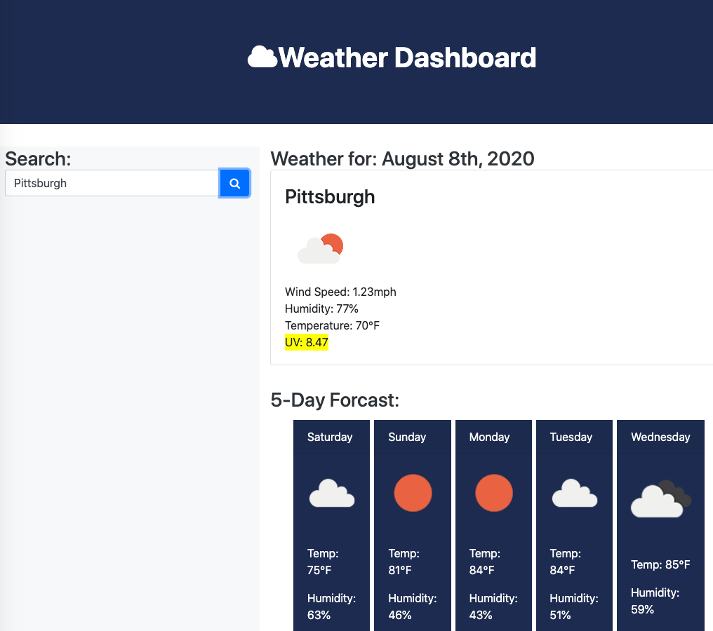

###  Server-Side APIs: Weather Dashboard

Link to app: 
This app retrieves data from the [OpenWeather API](https://openweathermap.org/api) to retrieve weather data for cities. This app runs in the browser, uses localStorage, and features dynamically updated HTML and CSS.
```

## User Story

AS A traveler
I WANT to see the weather outlook for multiple cities
SO THAT I can plan a trip accordingly
```

## Acceptance Criteria

GIVEN a weather dashboard with form inputs

* (Complete) WHEN I search for a city, THEN I am presented with current and future conditions for that city and that city is added to the search history
* (Complete) WHEN I view current weather conditions for that city, THEN I am presented with the city name, the date, an icon representation of weather conditions, the temperature, the humidity, the wind speed, and the UV index
* (Complete) WHEN I view the UV index, THEN I am presented with a color that indicates whether the conditions are favorable, moderate, or severe
* (Complete) WHEN I view future weather conditions for that city, THEN I am presented with a 5-day forecast that displays the date, an icon representation of weather conditions, the temperature, and the humidity
* (Complete) WHEN I click on a city in the search history, THEN I am again presented with current and future conditions for that city
* (Complete) WHEN I open the weather dashboard, THEN I am presented with the last searched city forecast
```
## Screenshot

 
